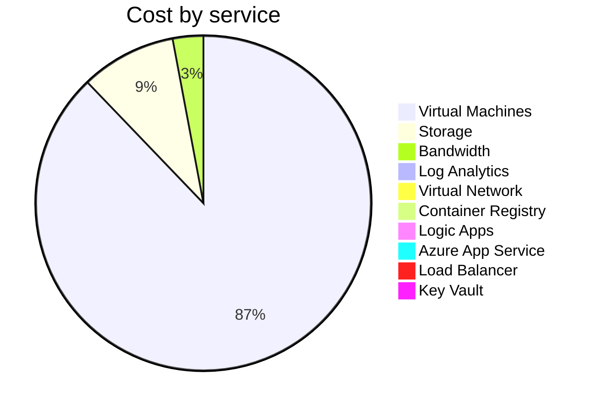
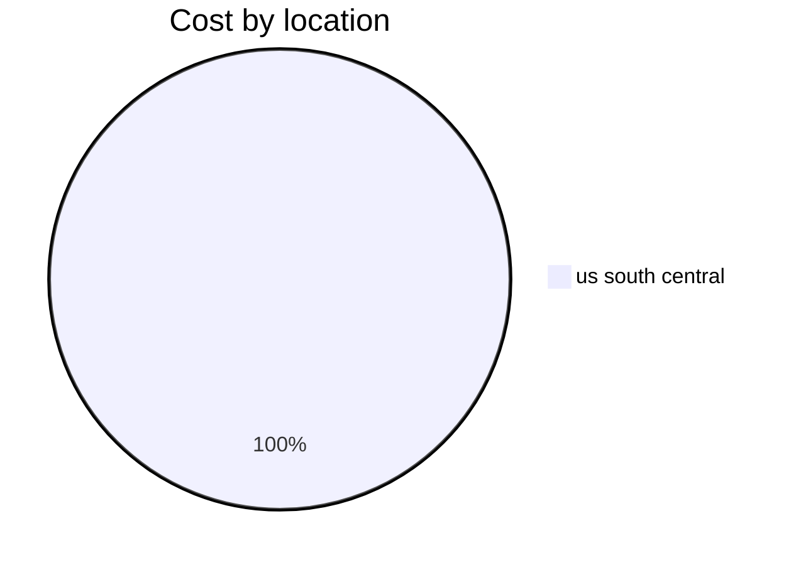
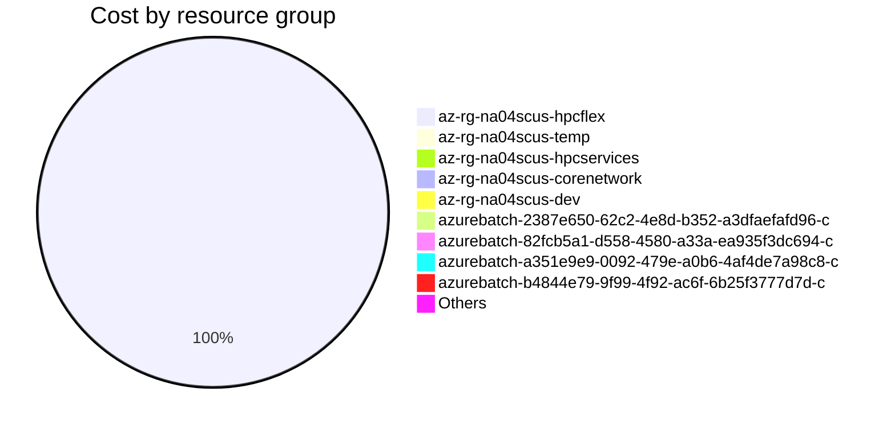

# Azure Cost Overview

> Accumulated cost for subscription id `TechnipFMC-NorthAmerica-HPC` from **2/1/2025** to **2/28/2025**

## Totals

|Period|Amount|
|---|---:|
|Today|0.00 USD|
|Yesterday|0.00 USD|
|Last 7 days|0.00 USD|
|Last 30 days|19,919.39 USD|
|Total cost in timeframe|36,252.49 USD|

```mermaid
gantt
   title Accumulated cost
   dateFormat  X
   axisFormat %s
   section 01 Feb
   USD 490.22 :0, 49022
   section 02 Feb
   USD 1045.48 :0, 104548
   section 03 Feb
   USD 2133.64 :0, 213364
   section 04 Feb
   USD 3306.24 :0, 330624
   section 05 Feb
   USD 4820.32 :0, 482032
   section 06 Feb
   USD 5777.57 :0, 577757
   section 07 Feb
   USD 6655.57 :0, 665557
   section 08 Feb
   USD 6963.04 :0, 696304
   section 09 Feb
   USD 7179.14 :0, 717914
   section 10 Feb
   USD 8330.75 :0, 833075
   section 11 Feb
   USD 10381.76 :0, 1038176
   section 12 Feb
   USD 12188.21 :0, 1218821
   section 13 Feb
   USD 13985.33 :0, 1398533
   section 14 Feb
   USD 15723.95 :0, 1572395
   section 15 Feb
   USD 16333.10 :0, 1633310
   section 16 Feb
   USD 16779.53 :0, 1677953
   section 17 Feb
   USD 17874.02 :0, 1787402
   section 18 Feb
   USD 19497.57 :0, 1949757
   section 19 Feb
   USD 21579.20 :0, 2157920
   section 20 Feb
   USD 23290.62 :0, 2329062
   section 21 Feb
   USD 24638.44 :0, 2463844
   section 22 Feb
   USD 25685.96 :0, 2568596
   section 23 Feb
   USD 26578.27 :0, 2657827
   section 24 Feb
   USD 27994.48 :0, 2799448
   section 25 Feb
   USD 29792.79 :0, 2979279
   section 26 Feb
   USD 31888.30 :0, 3188830
   section 27 Feb
   USD 34063.31 :0, 3406331
   section 28 Feb
   USD 36252.49 :0, 3625249
   section 17 Mar
   USD 36563.00 : done, 0, 3656300
   section 18 Mar
   USD 37386.23 : done, 0, 3738623
   section 19 Mar
   USD 38667.02 : done, 0, 3866702
   section 20 Mar
   USD 39597.60 : done, 0, 3959760
   section 21 Mar
   USD 40236.73 : done, 0, 4023673
   section 22 Mar
   USD 40506.72 : done, 0, 4050672
   section 23 Mar
   USD 40506.72 : done, 0, 4050672
   section 24 Mar
   USD 41040.23 : done, 0, 4104023
   section 25 Mar
   USD 41771.49 : done, 0, 4177149
   section 26 Mar
   USD 42852.86 : done, 0, 4285286
   section 27 Mar
   USD 43584.01 : done, 0, 4358401
   section 28 Mar
   USD 44023.72 : done, 0, 4402372
   section 29 Mar
   USD 44094.29 : done, 0, 4409429
   section 30 Mar
   USD 44094.29 : done, 0, 4409429
   section 31 Mar
   USD 44428.37 : done, 0, 4442837
```

## By Service Name

|Service|Amount|
|---|---:|
|Virtual Machines|31,508.76 USD|
|Storage|3,304.15 USD|
|Bandwidth|1,058.17 USD|
|Log Analytics|330.39 USD|
|Virtual Network|43.91 USD|
|Container Registry|4.82 USD|
|Logic Apps|1.91 USD|
|Azure App Service|0.36 USD|
|Load Balancer|0.01 USD|
|Key Vault|0.01 USD|

## By Location

|Location|Amount|
|---|---:|
|us south central|36,252.49 USD|

## By Resource Group

|Resource Group|Amount|
|---|---:|
|az-rg-na04scus-hpcflex|36,116.18 USD|
|az-rg-na04scus-temp|71.94 USD|
|az-rg-na04scus-hpcservices|48.59 USD|
|az-rg-na04scus-corenetwork|6.33 USD|
|az-rg-na04scus-dev|4.72 USD|
|azurebatch-2387e650-62c2-4e8d-b352-a3dfaefafd96-c|1.75 USD|
|azurebatch-82fcb5a1-d558-4580-a33a-ea935f3dc694-c|1.71 USD|
|azurebatch-a351e9e9-0092-479e-a0b6-4af4de7a98c8-c|0.67 USD|
|azurebatch-b4844e79-9f99-4f92-ac6f-6b25f3777d7d-c|0.20 USD|
|Others|0.39 USD|

Generated at 2025-03-18 12:55:01 for subscription with id `3568488a-15b8-45b7-8982-9e812e741200`
